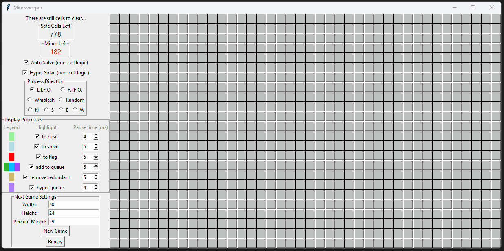
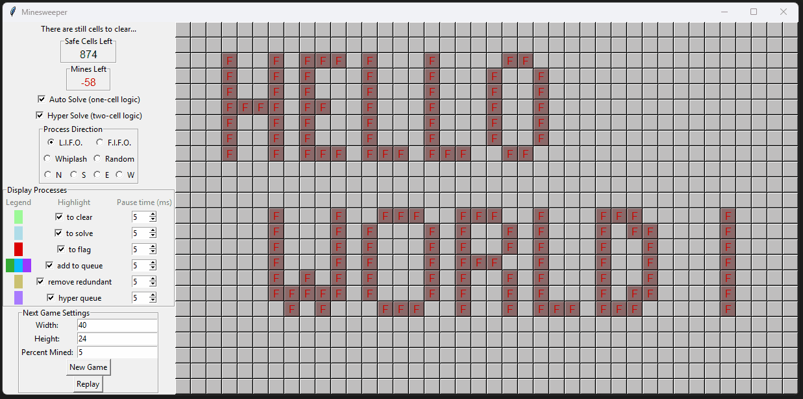

## 🚀 Auto-Minesweeper — A Visual Logic Solver for Minesweeper
**🧠 Capstone project from 2021 — now evolving through a 2025 engineering lens**

---

### 🎯 What This Is
Auto-Minesweeper is a Python-based logic engine that plays Minesweeper using human-style reasoning. It doesn't guess. It deduces. Each move is visualized step-by-step, showing why it’s made and how safe or mined cells are inferred from the surrounding board.

Originally built as my Python capstone project in 2021, this tool was my first serious exercise in object-oriented design and modular logic programming. Today, I’m revisiting it with years of engineering growth to refactor, modularize, and test it with production-quality practices.

---

### ✅ Core Features (Already Functional)
- **Visual deduction engine** — Solver shows its reasoning in real time
- **Board customization** — Choose size, mine density, or manually place mines (even custom patterns!)
- **Multiple solver modes** — FIFO, LIFO, directional, and random logic ordering
- **First-click safety** — Mines never appear on or near the first move
- **Two-level inference** — Hyper Solve mode supports advanced multi-cell logic using overlapping neighbor sets

---

### 🧩 How It Works (Architecture Overview)
- **`Game` class** manages board state, solver coordination, win/loss logic
- **`Cell` class** encapsulates individual tile behavior with Tkinter visuals
- **`Minefield`** maps (x, y) coordinates to `Cell` instances and handles mine placement and uncovering logic
- **`Block`** (from `neighborhood.py`) represents a cell’s neighbors, classifying them as flagged/naked/unknown to apply local rules
- **`Neighborhood`** enables second-order logic by analyzing intersecting `Blocks` of adjacent cells — this is the heart of hyper-solving
- **`Queue` and `SuperQueue`** control logic traversal, solver direction (eastward, random, etc.), and visual step pacing with user-adjustable settings

---

### 🔧 Refactor Goals (2025 Roadmap)
This project is in active refactor. Current goals include:
- 🧼 Full MVC separation (logic decoupled from UI)
- 🧪 Unit test coverage with `unittest`
- ⚙️ Replace list-based queues with `collections.deque`
- 📊 Add performance profiling (`cProfile`, `py-call-graph`)
- 🧠 Optional probabilistic fallback logic for ambiguous states
- 🔌 Config-driven solver settings (JSON/YAML)

---

### 📸 Visual Demo

#### 🎥 Visual debugging in action  
Solver logic unfolds with live step control, pause tuning, and dynamic highlights.  

#### 🎥 From manual test board to directional solve  
Highlights first-click safety, configurable logic direction, and board initialization for rule testing.  

---

### ✍️ Engineer's Commentary
This was the project where object-oriented design first clicked for me. Writing this solver taught me how to break down complex logic into reusable parts, how to make the invisible visible through UI, and how to structure code that explains itself as it runs.

Revisiting this code years later, I can see every design decision I’ve outgrown — and that’s what makes this refactor exciting. The original project still works, and it teaches. But now, it’s also a benchmark: a canvas for clean abstractions, better state management, and structured reasoning at scale.

---

### 📌 For Reviewers & Recruiters
This isn’t just a Minesweeper clone. It’s a logic debugger, a UI-controlled engine, and a personal milestone. Check the commit history and PRs to follow the refactor in progress.

Whether you're into structured problem solving, system design, or Python OOP — you're welcome to explore, fork, or follow.
